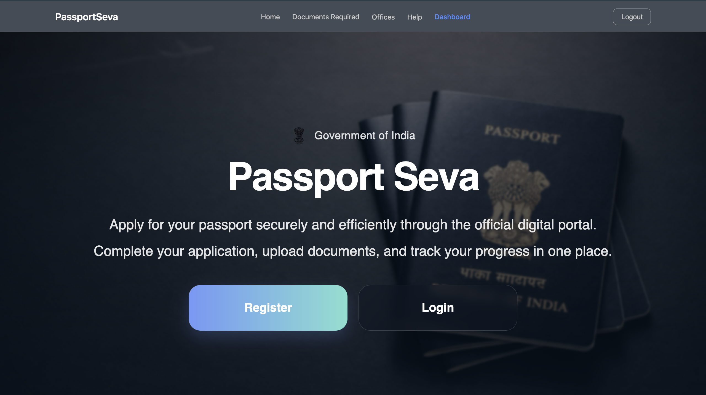
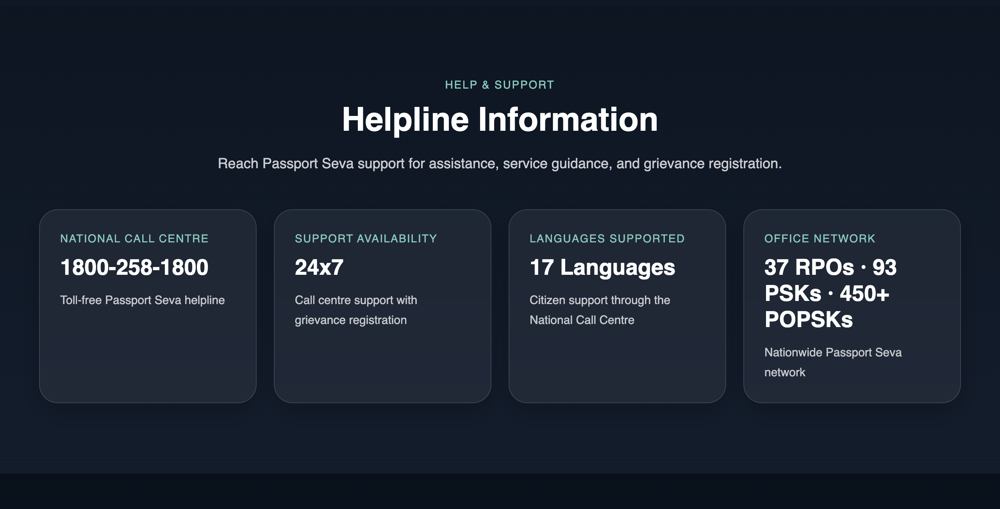
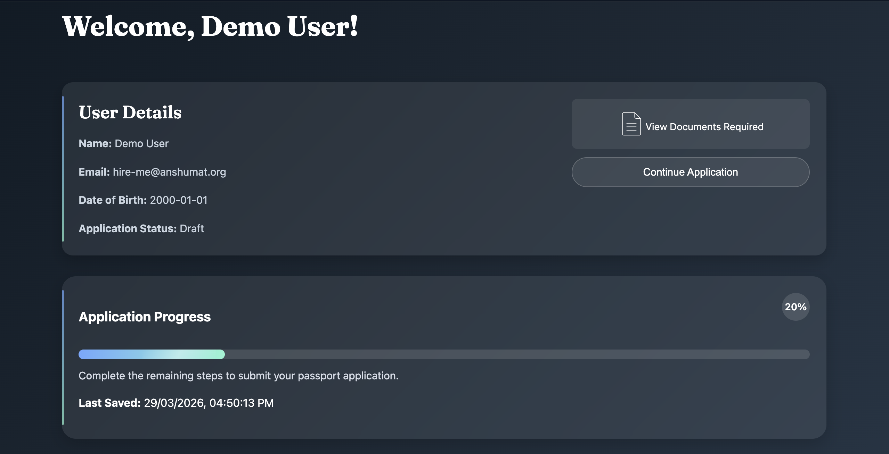
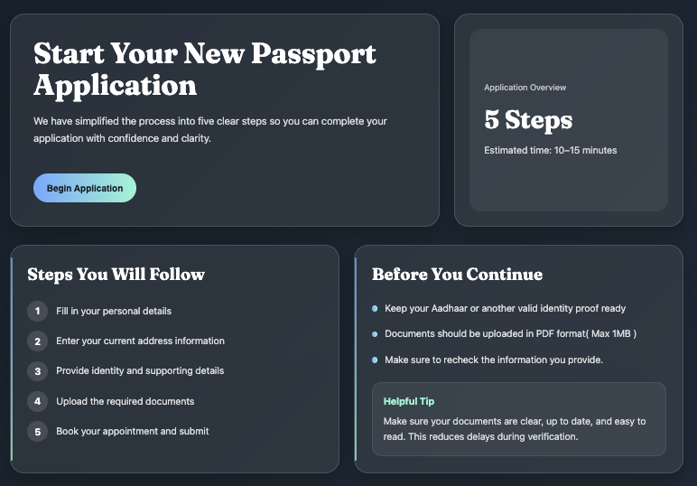
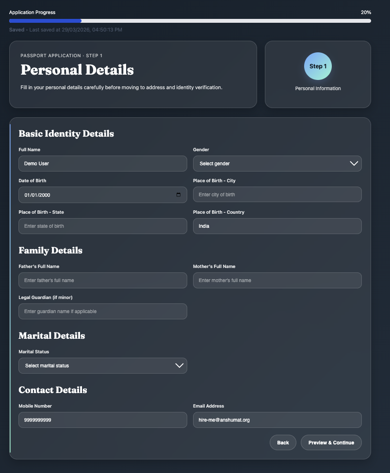
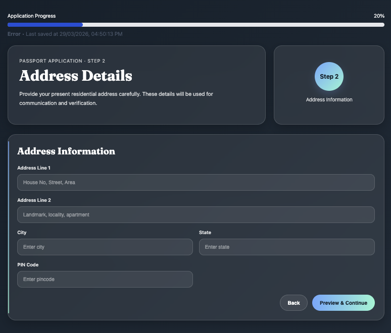
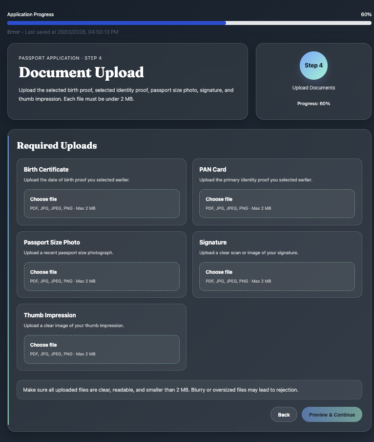
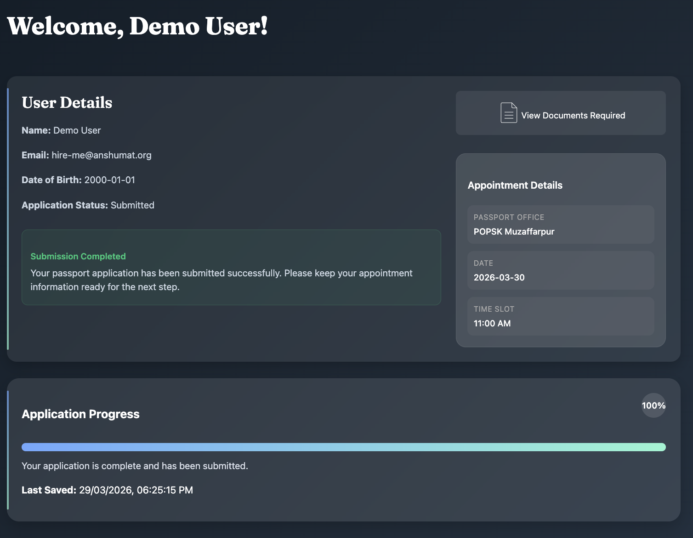

# PassportSeva Web Application

## Overview

PassportSeva is a modern, user-friendly web application designed to simplify and streamline the passport application process. The platform provides a structured, step-by-step workflow that guides users through registration, data entry, document submission, appointment scheduling, and final submission.

The application focuses on reducing complexity, improving clarity, and enhancing user experience, especially for first-time applicants.

-[Step-by-Step Application Walkthrough](https://drive.google.com/drive/folders/1UyP3cmJ75V6VttvK6WlKsST18IOOLeKT?usp=sharing)

---

## Objectives

- Simplify the passport application process
- Provide a guided and structured workflow
- Reduce user errors through validation and previews
- Improve accessibility and usability
- Enable users to track progress and complete applications efficiently

## Problems catered to :-

### Key Issues with the current System :

- Complex and unclear application flow
- Poor guidance and validation
- Lack of progress visibility

### User Frustrations :

- Confusing document requirements
- Data loss and repeated input
- Unclear errors and navigation

### Confusion & Drop-Off Points :

- Registration and onboarding
- Document upload stage
- Appointment booking and final submission

## Key Enhancements :-

### 1. Step-by-Step Application Flow

The application is divided into clearly defined steps:

1. Personal Details
2. Address Information
3. Identity Details
4. Document Upload
5. Appointment Booking
6. Review and Submission

Each step ensures focused data entry and reduces user overwhelm.

---

### 2. Progress Tracking

- Dynamic progress bar indicating completion status
- Real-time updates based on filled sections
- Encourages users to complete the application systematically

---

### 3. Auto-Save Functionality

- User inputs are automatically saved
- Prevents data loss during navigation or refresh
- Timestamp-based save status display

---

### 4. Form Validation

- Input validation for all critical fields
- Prevents submission of incomplete or incorrect data
- Ensures compliance with required formats (email, phone, etc.)

---

### 5. Document Management

- Structured document upload system
- Supports identity and address proof submissions
- Clear indication of required and optional documents

---

### 6. Appointment Booking

- Allows users to select available time slots
- Organized scheduling interface
- Ensures smooth coordination with passport offices

---

### 7. Review and Confirmation

- Final preview of all entered data before submission
- Mandatory confirmation checkbox for user verification
- Option to download the filled application as PDF for reference .

---

### 10. Responsive Design

- Fully responsive across devices (desktop, tablet, mobile)
- Clean and modern UI for better accessibility
- Consistent user experience across screen sizes

---

### 101. Navigation System

- Dynamic navbar based on authentication state
- Smooth scrolling and section navigation
- Quick access to important sections like Documents Required

---

## Functional Workflow :-

1. User registers and logs into the system
2. Begins application from dashboard
3. Completes each section step-by-step
4. Data is saved automatically after each interaction
5. Uploads required documents
6. Selects appointment slot
7. Reviews complete application
8. Confirms and submits

---

## Technology Stack :-

### Frontend :

- **React (with Vite):** Enables fast development, component-based architecture, and high performance.
- **React Router:** Provides smooth navigation for the multi-step application flow.
- **CSS Modules:** Ensures scoped, maintainable, and consistent styling.
- **Context API:** Manages global state efficiently across different components and pages.

### Backend :

- **FLASK:** Offers a lightweight, flexible, and scalable backend for handling core functionalities.
- **JSON-based Communication:** Ensures standardized, efficient, and easy data exchange between frontend and backend.

---

## Future Enhancements :-

- Integration with official passport APIs
- The application can be deployed on the web to enable seamless access and full-scale implementation.
- Real-time appointment availability updates
- Notification system (email/SMS)
- Document verification using AI
- Payment gateway integration

---

## Quick Glance :










---

## Quick Setup Guide

Follow the steps below to run the application locally after downloading the project ZIP.

---

### Prerequisites

- Node.js (v16 or higher)
- npm (comes with Node)
- Python (v3.8+)

---

## Project Setup Guide

Follow the steps below to run the backend after downloading the project.

---

### 1. Extract the Project

- Unzip the downloaded project folder.

---

### 2. Open in Code Editor

- Open the project folder in **VS Code** or any other code editor.

---

### 3. Open Terminal

- Open the integrated terminal inside the editor.

## Backend Setup

### Step 1: Navigate to Backend Folder

```bash
cd backend
```

### Step 2: Create virtual environment

#### For Mac :

```bash
python3 -m venv venv
source venv/bin/activate
```

#### For Windows :

```bash
python -m venv venv
venv\Scripts\activate
```

### Step 3: Start the backend server

#### For Mac :

```bash
export FLASK_APP=app.py
flask run
```

#### For Windows :

```bash
set FLASK_APP=app.py
flask run
```

## Frontend Setup

### Step 1: Navigate to Frontend Folder

```bash
cd frontend
```

### Step 2: Install frontend dependencies

```bash
npm install
```

### Step 3: Start the frontend development server

```bash
npm run dev
```
